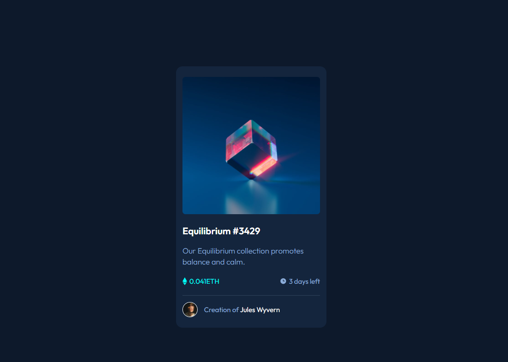

# Frontend Mentor - Solução do NFT Preview card
A solução para o desafio do cartão de visualização de NFT no Frontend Mentor, os desafios em conjunto com o DevQuest ajudam a melhorar as habilidades de codificação na construção de projetos realistas.

## Conteúdos
- [O Desafio](#Odesafio)
- [Captura de tela](#Capturadetela)
- [Links](#Links)
- [Tecnologias Utilizadas](#Tecnologiasutilizadas)
- [Autor](Autor)
- [Agradecimentos](Agradecimentos)

### O desafio
Os usuários evem ser capzes de visualizar o layout dependendo do tamanho da tela do dispositivo e ver os estados de hover para elementos interativos. 

### Captura de tela

### Links
URL da solução: Adicione a URL da solução aqui

URL do site ao vivo: Adicione a URL do site aqui

### Tecnologias utilizadas
- HTML
- CSS
- Flexbox 
- Styled Components

### Autor
- Linkedin - [Aline Seravali](https://www.linkedin.com/in/aline-seravali-bandeira-meireles-da-silva-b8b8311b6)

- Frontend Mentor - [@DevSeravali](https://www.frontendmentor.io/profile/devseravali)

- GitHub - [@DevSeravali](https://github.com/devseravali)

### Agradecimentos
Agradeço a todos que acreditam na minha capacidade e, em especial, ao DevQuest, por mostrar que programação vai muito além de simplesmente digitar códigos.